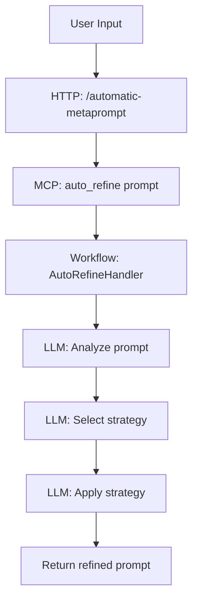
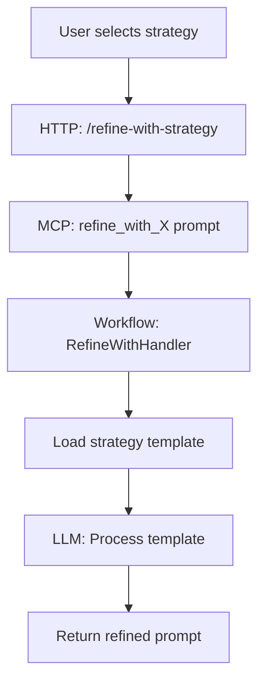
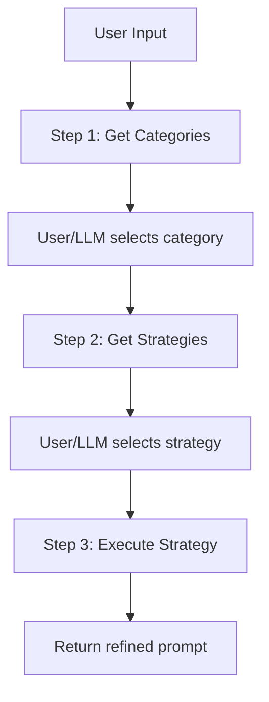

# Prompt++ Architecture Deep Dive

## System Architecture

### Layer 1: External Interface Layer

#### HTTP API (UI Bridge)
- **Technology**: Express.js with Socket.IO
- **Endpoints**:
  - `GET /strategies` - List all available strategies
  - `GET /strategies/:id` - Get specific strategy details
  - `POST /automatic-metaprompt` - Auto-select and apply best strategy
  - `POST /refine-with-strategy` - Apply specific strategy
  - `GET /metrics` - Performance and usage metrics
  - `POST /collections` - Manage strategy collections

#### MCP Server Interface
- **Protocol**: Model Context Protocol (MCP)
- **Transport**: STDIO (standard input/output)
- **Capabilities**: Prompts and Tools

### Layer 2: Protocol Translation Layer

#### MCP-HTTP Bridge (`mcp-http-bridge.cjs`)
```javascript
HTTP Request → JSON-RPC Message → MCP Process → Response Parsing → HTTP Response
```

**Key Functions**:
- Request ID management for async operations
- Buffer management for STDIO communication
- Response correlation and timeout handling

### Layer 3: Core Business Logic

#### Workflow Factory Pattern
```typescript
interface WorkflowHandler {
  handle(args: Record<string, any>): Promise<WorkflowResponse>
}

Workflows:
├── AutoRefineHandler (intelligent selection)
├── RefineWithHandler (direct application)
├── CompareRefinementsHandler (multi-strategy analysis)
├── TwoStepWorkflowHandler (prepare → execute)
└── ThreeStepWorkflowHandler (category → strategy → execute)
```

#### Strategy Management
```
StrategyManager
├── Built-in Strategies (5 categories, 44+ strategies)
├── Custom Strategies (user-defined)
├── Collections (grouped strategies)
└── Caching Layer (LRU Cache)
```

### Layer 4: Data Layer

#### Strategy Storage Structure
```
metaprompts/
├── _metadata.json (category metadata)
├── core_strategies/
│   ├── _metadata.json
│   ├── arpe.json
│   ├── star.json
│   └── ...
├── software_development/
├── ai_core_principles/
├── vibe_coding_rules/
└── advanced_thinking/

~/.prompt-plus-plus/
├── custom-prompts/ (user strategies)
└── collections.json
```

## Data Models

### Strategy Definition
```typescript
interface StrategyInfo {
  key: string                    // Unique identifier
  name: string                   // Display name
  description: string            // Brief description
  template: string              // Metaprompt template
  examples: string[]            // Usage examples
  category?: string             // Built-in category
  customCategory?: string       // Custom category
  complexity?: 'Low' | 'Medium' | 'High'
  timeInvestment?: 'Low' | 'Medium' | 'High'
  triggers?: string[]           // Activation keywords
  bestFor?: string[]           // Ideal use cases
  source?: 'built-in' | 'custom'
}
```

### Category Metadata
```typescript
interface CategoryMetadata {
  category: string
  description: string
  use_cases: string[]
  strategies: StrategyMetadata[]
}
```

### MCP Message Format
```typescript
// Request
{
  jsonrpc: '2.0',
  id: number,
  method: string,
  params: object
}

// Response
{
  jsonrpc: '2.0',
  id: number,
  result?: any,
  error?: {
    code: number,
    message: string,
    data?: any
  }
}
```

## Process Flows

### 1. Auto-Refinement Flow



### 2. Direct Strategy Application



### 3. Three-Step Refinement



## Key Design Patterns

### 1. Factory Pattern
- **Usage**: WorkflowFactory for creating handlers
- **Benefit**: Extensible workflow system

### 2. Strategy Pattern
- **Usage**: Different refinement approaches
- **Benefit**: Flexible algorithm selection

### 3. Adapter Pattern
- **Usage**: MCP-HTTP bridge
- **Benefit**: Protocol translation

### 4. Lazy Loading
- **Usage**: Strategy loading on demand
- **Benefit**: Improved startup performance

### 5. Caching Pattern
- **Usage**: LRU cache for strategies
- **Benefit**: Reduced file I/O

## Performance Characteristics

### Bottlenecks
1. **LLM API Calls**: Primary latency source (1-5 seconds)
2. **File I/O**: Strategy loading (mitigated by caching)
3. **Process Communication**: STDIO buffering

### Optimization Strategies
1. **Parallel Loading**: Load strategies concurrently
2. **Request Batching**: Group multiple refinements
3. **Cache Warming**: Preload popular strategies
4. **Connection Pooling**: Reuse MCP connections

## Security Considerations

### Current State
- No authentication on endpoints
- No rate limiting
- Limited input validation
- Trusts all file system content

### Recommendations
1. **Add API Authentication**
   - JWT tokens for API access
   - API key management

2. **Implement Rate Limiting**
   - Per-IP request limits
   - Strategy usage quotas

3. **Input Validation**
   - Prompt length limits
   - Content filtering
   - Injection prevention

4. **Secure File Access**
   - Validate JSON schemas
   - Sandbox custom strategies
   - Path traversal protection

## Scalability Paths

### Horizontal Scaling
```
Load Balancer
     ↓
HTTP Bridge Instances (N)
     ↓
MCP Server Pool (M)
     ↓
Shared Cache (Redis)
```

### Vertical Scaling
- Increase worker processes
- Optimize LLM batch processing
- Implement GPU acceleration

### Microservices Architecture
```
API Gateway
├── Strategy Service
├── Refinement Service
├── Analytics Service
└── User Service
```

## Monitoring Points

### Key Metrics
1. **Performance**
   - Strategy selection time
   - LLM response time
   - Cache hit rate
   - Request throughput

2. **Business**
   - Strategy usage frequency
   - User satisfaction scores
   - Refinement quality metrics

3. **System Health**
   - Error rates
   - Process memory usage
   - Queue depths

### Logging Strategy
```typescript
logger.info('workflow.started', {
  workflow: 'auto_refine',
  promptLength: prompt.length,
  timestamp: Date.now()
});
```

## Future Architecture Considerations

### Event-Driven Architecture
- Publish refinement events
- Enable real-time analytics
- Support webhooks

### Plugin System
- Strategy provider interface
- Custom workflow plugins
- Middleware pipeline

### Multi-Model Support
- Abstract LLM interface
- Support multiple AI providers
- Model performance comparison

This architecture provides a solid foundation for a production-ready prompt refinement system with clear extension points for future enhancements.