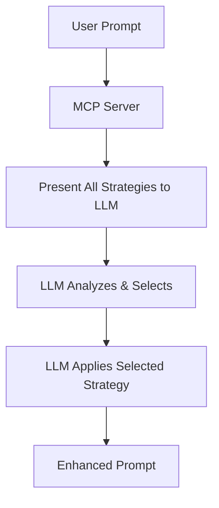

# How Prompt++ MCP Process Works

## Overview

Prompt++ MCP is a **Meta-Prompt Server** that helps LLMs enhance prompts. The key principle is:

> **The MCP server ONLY provides prompt templates and metadata. The LLM makes ALL decisions about which strategy to use.**

## The Process Flow



## How It Works: Step by Step

### 1. User Provides Original Prompt

```
User: "Write a Python function to calculate fibonacci"
```

### 2. MCP Server Presents ALL Available Strategies

The server sends this to the LLM:

```
You are an expert prompt engineer. Your task is to analyze the user's prompt and select the most appropriate strategy from all available options, then apply it.

**User's Prompt:** Write a Python function to calculate fibonacci

**Available Strategy Categories & Options:**
{
  "core_strategies": {
    "category": "Core Strategies",
    "description": "Fundamental prompt enhancement approaches",
    "strategies": {
      "star": {
        "name": "ECHO Prompt", 
        "description": "Comprehensive multi-stage refinement",
        "best_for": ["complex tasks", "creative work"],
        "complexity": "high"
      },
      "done": {
        "name": "Done Prompt",
        "description": "Structured approach with role-playing",
        "best_for": ["general tasks", "business problems"],
        "complexity": "medium"
      },
      // ... 8 more strategies
    }
  },
  "software_development": {
    "category": "Software Development",
    "description": "Code and system design focused strategies",
    "strategies": {
      "boomerang": {
        "name": "Boomerang Development",
        "description": "Iterative development with testing cycles",
        "best_for": ["api development", "feature implementation"],
        "triggers": ["iterative", "testing", "development"],
        "complexity": "medium"
      },
      // ... 3 more strategies
    }
  },
  // ... 3 more categories with 30+ more strategies
}

**Your Process:**
1. Analyze the user's prompt
2. Review all available strategies
3. Select the most appropriate strategy
4. Apply the selected strategy
```

### 3. LLM Makes the Decision

The LLM analyzes and responds:

```
SELECTED STRATEGY: boomerang (software_development)

REASONING: The user wants to implement a specific algorithm (Fibonacci). The Boomerang Development strategy is optimal because:
- It focuses on iterative development with testing
- Perfect for algorithm implementation
- Includes performance considerations
- Emphasizes clean, testable code

REFINED PROMPT:
Create a Python implementation of the Fibonacci sequence with the following requirements:

1. **Core Implementation**:
   - Function named `fibonacci(n)` that returns the nth Fibonacci number
   - Handle edge cases (n < 0, n = 0, n = 1)
   - Include both iterative and recursive implementations

2. **Performance Requirements**:
   - Optimize for large values of n (up to 1000)
   - Include memoization for the recursive version
   - Document time and space complexity

3. **Testing Requirements**:
   - Include comprehensive unit tests
   - Test edge cases and performance
   - Validate against known Fibonacci values

4. **Code Quality**:
   - Follow PEP 8 style guidelines
   - Include detailed docstrings
   - Add type hints for all functions

5. **Deliverables**:
   - Main implementation file
   - Test file with pytest
   - Performance comparison between approaches
   - README with usage examples

KEY IMPROVEMENTS:
- Added specific implementation requirements
- Included performance optimization needs
- Specified testing requirements
- Added code quality standards
- Defined clear deliverables
```

## Workflow Examples

### Example 1: Auto-Refine Workflow

**Input:**
```
mcp_prompt: auto_refine
user_prompt: "Create a microservices architecture"
```

**What MCP Server Does:**
1. Loads all 44+ strategies from 5 categories
2. Presents them ALL to the LLM with metadata
3. Asks LLM to analyze and choose

**What LLM Does:**
1. Reviews all strategies
2. Notices "architect" strategy in Software Development category
3. Selects it because it's specifically for "system design and architecture"
4. Applies the architect methodology
5. Returns enhanced architectural prompt

### Example 2: Three-Step Intelligent Workflow

**Step 1 - Category Selection:**

```
User: "I need to make a difficult decision about our product roadmap"

MCP presents all 5 categories:
- Core Strategies
- Software Development  
- AI Core Principles (Critical thinking frameworks)
- Vibe Coding Rules
- Advanced Thinking

LLM selects: "AI Core Principles" because it contains decision-making frameworks
```

**Step 2 - Strategy Selection:**

```
MCP presents all strategies in AI Core Principles:
- assumption_detector
- devils_advocate (Generate counterarguments)
- ripple_effect
- perspective_multiplier
- ... 9 more

LLM selects: "devils_advocate" for systematic decision analysis
```

**Step 3 - Strategy Execution:**

```
MCP provides the devils_advocate template
LLM applies it to create a comprehensive decision framework
```

### Example 3: Compare Refinements

**Without Specified Strategies:**

```
User: "Help me optimize database queries"

MCP presents ALL strategies to LLM
LLM independently selects 3-5 relevant ones:
- boomerang (iterative optimization)
- reviewer (performance review)
- pattern_recognizer (identify optimization patterns)

Then compares their approaches
```

## Key Differences from Hardcoded Approach

### ❌ OLD (Hardcoded) Approach:
```python
# Server code that made decisions
if "fibonacci" in prompt or "algorithm" in prompt:
    return "boomerang"  # Server decided!
elif "decision" in prompt:
    return "devils_advocate"  # Server decided!
```

### ✅ NEW (LLM-Driven) Approach:
```python
# Server only provides data
return {
    "all_strategies": get_all_strategies(),
    "instruction": "You analyze and decide"
}
# LLM makes the decision!
```

## Real-World Process Example

### Scenario: Complex Technical Task

**User Prompt:** 
```
"Build a real-time chat system with websockets"
```

**Process:**

1. **MCP Server Action:**
   - Loads metadata for all 44+ strategies
   - Formats them with descriptions, use cases, complexity
   - Sends everything to LLM

2. **LLM Analysis:**
   ```
   Analyzing prompt characteristics:
   - Domain: Software development
   - Type: System implementation
   - Complexity: High
   - Key aspects: real-time, networking, architecture
   
   Reviewing all strategies...
   
   Best matches:
   - architect: System design focus ✓
   - boomerang: Iterative development ✓
   - devops: Infrastructure needs ✓
   ```

3. **LLM Selection:**
   ```
   SELECTED: architect
   REASON: Building a real-time system requires careful architectural planning
   ```

4. **LLM Enhancement:**
   ```
   Applies architect methodology to create comprehensive system design prompt
   with scalability, security, and performance considerations
   ```

## Benefits of LLM-Driven Selection

1. **Context-Aware**: LLM understands nuances humans might miss
2. **Flexible**: Can combine insights from multiple strategies
3. **Intelligent**: Makes connections between prompt intent and strategy strengths
4. **Adaptive**: Learns from context to make better selections
5. **Transparent**: Explains why each strategy was chosen

## Common Patterns

### Technical Tasks
- LLM often selects from Software Development category
- Frequently chooses: boomerang, architect, reviewer

### Decision Making
- LLM gravitates toward AI Core Principles
- Common picks: devils_advocate, tradeoff_tracker, ripple_effect

### Creative Work
- LLM selects from Core Strategies or Advanced Thinking
- Popular choices: star, synthesis, quantum

### Quick Tasks
- LLM identifies simplicity need
- Often selects: morphosis, done

## Summary

The Prompt++ MCP server is a **pure data provider**. It:
- ✅ Loads strategy templates and metadata
- ✅ Presents all options to the LLM
- ✅ Provides structured prompts for LLM to process
- ❌ Does NOT make selection decisions
- ❌ Does NOT analyze prompts
- ❌ Does NOT score strategies

The LLM is the **intelligent decision maker**. It:
- ✅ Analyzes the user's prompt
- ✅ Reviews all available strategies
- ✅ Selects the best match
- ✅ Applies the strategy methodology
- ✅ Explains its reasoning

This separation ensures the system leverages the LLM's intelligence rather than relying on rigid keyword matching.