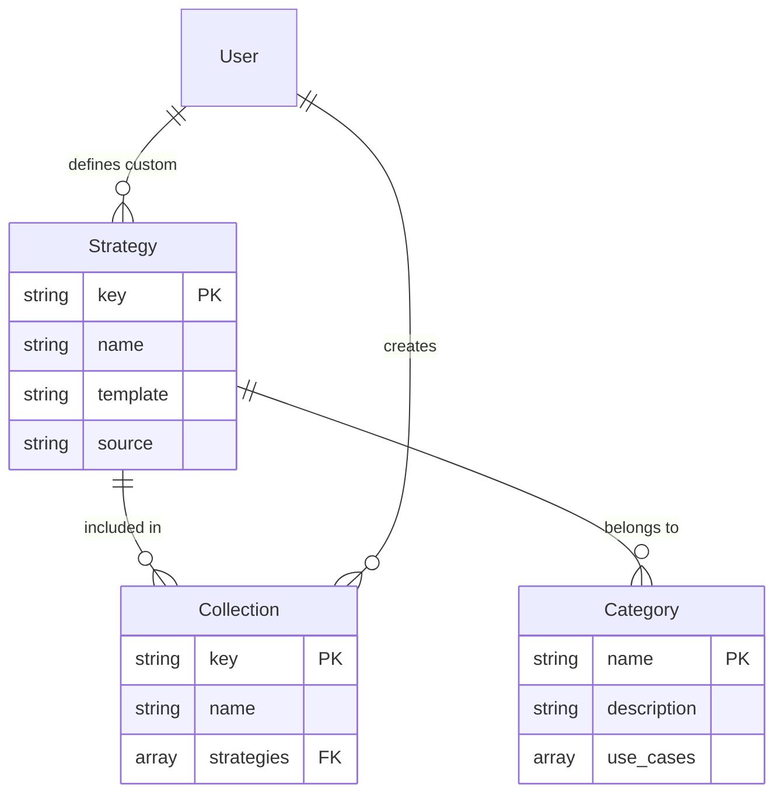

# Data Models and Schemas

## Core Data Models

### 1. StrategyInfo

Represents a metaprompt strategy for prompt refinement.

```typescript
interface StrategyInfo {
  key: string;                              // Unique identifier
  name: string;                             // Display name
  description: string;                      // Strategy description
  examples: string[];                       // Usage examples
  template: string;                         // Metaprompt template
  category?: string;                        // Built-in category
  complexity?: 'Low' | 'Medium' | 'High' | 'Medium-High';
  timeInvestment?: 'Low' | 'Medium' | 'High' | 'Medium-High';
  triggers?: string[];                      // Keywords that trigger this strategy
  bestFor?: string[];                       // Best use cases
  source?: 'built-in' | 'custom';          // Strategy source
  customCategory?: string;                  // Category for custom strategies
}
```

### 2. CategoryMetadata

Organizes strategies by category with rich metadata.

```typescript
interface CategoryMetadata {
  category: string;                         // Category name
  description: string;                      // Category description
  use_cases: string[];                      // When to use this category
  strategies: StrategyMetadata[];           // Strategies in category
}

interface StrategyMetadata {
  key: string;                              // Strategy key
  name: string;                             // Strategy name
  description: string;                      // Brief description
  best_for: string[];                       // Optimal use cases
  complexity: string;                       // Complexity level
  time_investment: string;                  // Time required
  triggers?: string[];                      // Trigger keywords
  output_focus?: string;                    // What the strategy produces
}
```

### 3. StrategyCollection

User-defined collections of strategies.

```typescript
interface StrategyCollection {
  name: string;                             // Collection display name
  description: string;                      // Collection description
  strategies: string[];                     // Array of strategy keys
  created?: string;                         // ISO-8601 timestamp
  updated?: string;                         // ISO-8601 timestamp
}

interface CollectionsConfig {
  collections: Record<string, StrategyCollection>;
}
```

### 4. Selection and Comparison Models

```typescript
interface AutoSelectionResult {
  user_query: string;                       // Original prompt
  recommended_strategy: string;             // Selected strategy key
  strategy_name: string;                    // Strategy display name
  reason: string;                           // Selection reasoning
  alternative: string;                      // Alternative strategy key
  alternative_name: string;                 // Alternative display name
  prompt_characteristics: {
    word_count: number;
    detected_type: string;                  // Prompt type/domain
  };
}

interface StrategyScore {
  suitability: number;                      // 0-100 score
  complexity: number;                       // Complexity rating
  strengths: string[];                      // Strategy strengths
}

interface ComparisonResult {
  prompt: string;                           // Original prompt
  comparisons: Record<string, {
    name: string;
    suitability: number;
    complexity: number;
    strengths: string[];
  }>;
  recommendation: string;                   // Best strategy
  reasoning: string;                        // Recommendation logic
}
```

### 5. Performance and Monitoring

```typescript
interface PerformanceMetrics {
  selectionTime: number;                    // Avg selection time (ms)
  strategyUsage: Record<string, number>;    // Usage count by strategy
  averageResponseTime: number;              // Avg response time (ms)
  errorCount: number;                       // Total errors
}

interface CacheEntry<T> {
  data: T;                                  // Cached data
  timestamp: number;                        // Cache time
  ttl?: number;                            // Time to live (ms)
}
```

## JSON Schema Definitions

### Custom Strategy Schema

```json
{
  "$schema": "http://json-schema.org/draft-07/schema#",
  "type": "object",
  "required": ["name", "description", "template"],
  "properties": {
    "name": {
      "type": "string",
      "minLength": 1,
      "description": "Strategy display name"
    },
    "description": {
      "type": "string",
      "minLength": 10,
      "description": "Clear description of what the strategy does"
    },
    "template": {
      "type": "string",
      "minLength": 50,
      "pattern": "\\[Insert initial prompt here\\]",
      "description": "Metaprompt template with placeholder"
    },
    "examples": {
      "type": "array",
      "items": { "type": "string" },
      "minItems": 1,
      "description": "Usage examples"
    },
    "complexity": {
      "type": "string",
      "enum": ["Low", "Medium", "High", "Medium-High"],
      "default": "Medium"
    },
    "timeInvestment": {
      "type": "string",
      "enum": ["Low", "Medium", "High", "Medium-High"],
      "default": "Medium"
    },
    "triggers": {
      "type": "array",
      "items": { "type": "string" },
      "description": "Keywords that indicate this strategy"
    },
    "bestFor": {
      "type": "array",
      "items": { "type": "string" },
      "description": "Best use cases"
    },
    "customCategory": {
      "type": "string",
      "description": "Category for organization"
    }
  }
}
```

### Category Metadata Schema

```json
{
  "$schema": "http://json-schema.org/draft-07/schema#",
  "type": "object",
  "required": ["description", "use_cases"],
  "properties": {
    "description": {
      "type": "string",
      "description": "Category description"
    },
    "use_cases": {
      "type": "array",
      "items": { "type": "string" },
      "minItems": 1,
      "description": "When to use this category"
    }
  }
}
```

## Database Schema (File-Based)

### Directory Structure

```
~/.prompt-plus-plus/
├── collections.json              # User collections
├── custom-prompts/              # Custom strategies
│   ├── _metadata.json           # Category metadata
│   ├── my-strategy.json         # Strategy definition
│   └── category/                # Organized by category
│       ├── _metadata.json
│       └── strategy.json
└── cache/                       # Performance cache
    └── metrics.json
```

### Collections File Format

```json
{
  "collections": {
    "favorites": {
      "name": "My Favorites",
      "description": "Frequently used strategies",
      "strategies": ["star", "assumption_detector", "architect"],
      "created": "2024-01-01T00:00:00Z",
      "updated": "2024-01-02T00:00:00Z"
    }
  }
}
```

## Relationships

### Strategy Relationships



### Data Flow Relationships

1. **Strategy Loading**:
   - Built-in strategies loaded from `metaprompts/`
   - Custom strategies loaded from `~/.prompt-plus-plus/custom-prompts/`
   - Merged into single strategy map

2. **Category Organization**:
   - Built-in categories from directory structure
   - Custom categories from `_metadata.json` files
   - Dynamic category assignment for custom strategies

3. **Collection Management**:
   - Collections reference strategies by key
   - Validation ensures referenced strategies exist
   - Collections persist across sessions

## Validation Rules

### Strategy Validation
- `name`: Required, non-empty string
- `description`: Required, minimum 10 characters
- `template`: Required, must contain placeholder
- `examples`: At least one example required
- `complexity`: Must be valid enum value
- `timeInvestment`: Must be valid enum value

### Collection Validation
- `name`: Required, non-empty string
- `description`: Required, non-empty string
- `strategies`: Array of valid strategy keys
- Strategy keys must exist in strategy registry

### Performance Constraints
- Cache TTL: 5 minutes for strategy data
- Maximum strategies per collection: 50
- Maximum custom strategies: 1000
- Maximum template size: 50KB