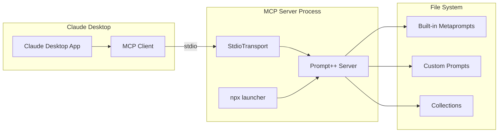

# Deployment Architecture

## Overview

Prompt++ MCP Server is designed for easy deployment as both a global npm package and a local MCP server for Claude Desktop integration.

## Deployment Options

### 1. NPM Global Installation

```bash
npm install -g prompt-plus-plus-mcp
```

**Advantages**:
- Single command installation
- Automatic PATH configuration
- Easy updates via npm
- Available system-wide

**File Locations**:
```
/usr/local/lib/node_modules/prompt-plus-plus-mcp/
├── dist/                 # Compiled JavaScript
├── metaprompts/         # Built-in strategies
└── package.json         # MCP configuration

~/.prompt-plus-plus/     # User data
├── custom-prompts/      # Custom strategies
└── collections.json     # User collections
```

### 2. NPX Execution (Recommended)

```bash
npx prompt-plus-plus-mcp
```

**Advantages**:
- No installation required
- Always runs latest version
- Isolated execution
- Perfect for Claude Desktop

### 3. Local Development

```bash
git clone https://github.com/bacoco/prompt-plus-plus-mcp
cd prompt-plus-plus-mcp
npm install
npm run build
```

## Claude Desktop Integration

### Configuration

**claude_desktop_config.json**:
```json
{
  "mcpServers": {
    "prompt-plus-plus": {
      "command": "npx",
      "args": ["prompt-plus-plus-mcp"],
      "env": {
        "PROMPT_PLUS_CUSTOM_DIR": "/path/to/custom/prompts"
      }
    }
  }
}
```

### Integration Architecture



## Infrastructure Requirements

### System Requirements

**Minimum**:
- Node.js 16.0.0+
- 128MB RAM
- 50MB disk space

**Recommended**:
- Node.js 20.0.0+
- 256MB RAM
- 100MB disk space

### Platform Support

| Platform | Support | Notes |
|----------|---------|-------|
| macOS | ✅ Full | Primary development platform |
| Linux | ✅ Full | All distributions with Node.js |
| Windows | ✅ Full | Windows 10/11, PowerShell/CMD |
| Docker | ✅ Full | See Docker deployment |

## Docker Deployment

### Dockerfile

```dockerfile
FROM node:20-alpine

# Install prompt-plus-plus-mcp globally
RUN npm install -g prompt-plus-plus-mcp

# Create custom prompts directory
RUN mkdir -p /root/.prompt-plus-plus/custom-prompts

# Set working directory
WORKDIR /app

# Copy custom prompts if available
COPY custom-prompts/* /root/.prompt-plus-plus/custom-prompts/

# Run as MCP server
CMD ["prompt-plus-plus-mcp"]
```

### Docker Compose

```yaml
version: '3.8'

services:
  prompt-plus-plus:
    build: .
    stdin_open: true
    tty: true
    volumes:
      - ./custom-prompts:/root/.prompt-plus-plus/custom-prompts
      - ./collections.json:/root/.prompt-plus-plus/collections.json
    environment:
      - NODE_ENV=production
      - LOG_LEVEL=info
```

## Production Deployment

### Environment Variables

```bash
# Custom prompts directory
export PROMPT_PLUS_CUSTOM_DIR="/opt/prompt-plus-plus/custom"

# Logging configuration
export LOG_LEVEL="info"  # debug, info, warn, error
export LOG_FORMAT="json" # json, pretty

# Performance tuning
export NODE_OPTIONS="--max-old-space-size=256"
```

### Process Management

**Using PM2**:
```javascript
// ecosystem.config.js
module.exports = {
  apps: [{
    name: 'prompt-plus-plus',
    script: 'prompt-plus-plus-mcp',
    instances: 1,
    autorestart: true,
    watch: false,
    max_memory_restart: '256M',
    env: {
      NODE_ENV: 'production'
    }
  }]
};
```

**Using systemd**:
```ini
[Unit]
Description=Prompt++ MCP Server
After=network.target

[Service]
Type=simple
User=mcp
WorkingDirectory=/opt/prompt-plus-plus
ExecStart=/usr/bin/npx prompt-plus-plus-mcp
Restart=on-failure
StandardInput=tty
TTYPath=/dev/pts/0

[Install]
WantedBy=multi-user.target
```

## Scaling Architecture

### Horizontal Scaling

Not applicable - MCP servers are single-user by design.

### Vertical Scaling

**Memory Optimization**:
```javascript
// Cache configuration
const CACHE_CONFIG = {
  maxSize: 1000,        // Maximum cached items
  ttl: 5 * 60 * 1000,  // 5 minute TTL
  checkPeriod: 60000   // Cleanup every minute
};
```

**Performance Tuning**:
- Lazy load strategies
- Implement LRU cache
- Optimize JSON parsing
- Use streaming for large responses

## Monitoring and Observability

### Health Checks

```bash
# Check server status
curl -X POST http://localhost:3000/mcp \
  -H "Content-Type: application/json" \
  -d '{"method": "tools/call", "params": {"name": "health_check"}}'
```

### Metrics Collection

```typescript
interface Metrics {
  // Request metrics
  totalRequests: number;
  requestsPerMinute: number;
  averageResponseTime: number;
  
  // Strategy metrics
  strategyUsage: Map<string, number>;
  cacheHitRate: number;
  
  // System metrics
  memoryUsage: number;
  cpuUsage: number;
  uptime: number;
}
```

### Logging Strategy

```typescript
// Structured logging
logger.info('Request processed', {
  method: request.method,
  duration: responseTime,
  strategy: selectedStrategy,
  timestamp: new Date().toISOString()
});
```

## Backup and Recovery

### Data Backup

**What to backup**:
1. Custom strategies: `~/.prompt-plus-plus/custom-prompts/`
2. Collections: `~/.prompt-plus-plus/collections.json`
3. Environment configuration

**Backup script**:
```bash
#!/bin/bash
BACKUP_DIR="/backup/prompt-plus-plus"
DATE=$(date +%Y%m%d_%H%M%S)

# Create backup
tar -czf "$BACKUP_DIR/prompt-plus-plus-$DATE.tar.gz" \
  ~/.prompt-plus-plus/ \
  /etc/prompt-plus-plus/

# Keep only last 7 days
find $BACKUP_DIR -name "*.tar.gz" -mtime +7 -delete
```

### Recovery Process

1. **Install server**: `npm install -g prompt-plus-plus-mcp`
2. **Restore data**: Extract backup to `~/.prompt-plus-plus/`
3. **Verify**: Run health check
4. **Test**: Execute test prompts

## Security Hardening

### Production Security

1. **Run as non-root user**
2. **Restrict file permissions**:
   ```bash
   chmod 700 ~/.prompt-plus-plus
   chmod 600 ~/.prompt-plus-plus/collections.json
   ```
3. **Use read-only file system** where possible
4. **Implement rate limiting** for resource-intensive operations

### Network Security

- No network ports opened
- Communication via stdio only
- Process isolation by design

## Troubleshooting

### Common Issues

**Server won't start**:
```bash
# Check Node.js version
node --version  # Must be 16.0.0+

# Check permissions
ls -la ~/.prompt-plus-plus/

# Verify installation
npm list -g prompt-plus-plus-mcp
```

**Custom strategies not loading**:
```bash
# Check directory
echo $PROMPT_PLUS_CUSTOM_DIR

# Validate JSON syntax
jq . ~/.prompt-plus-plus/custom-prompts/*.json

# Check logs
tail -f ~/.prompt-plus-plus/logs/error.log
```

### Debug Mode

```bash
# Enable debug logging
export LOG_LEVEL=debug
prompt-plus-plus-mcp

# Or with npx
LOG_LEVEL=debug npx prompt-plus-plus-mcp
```

## Upgrade Strategy

### Version Management

1. **Check current version**: `npm list -g prompt-plus-plus-mcp`
2. **Backup data**: See backup section
3. **Update**: `npm update -g prompt-plus-plus-mcp`
4. **Verify**: Run health check
5. **Test**: Execute test workflows

### Breaking Changes

- Semantic versioning followed
- Breaking changes in major versions only
- Migration guides provided
- Backward compatibility maintained in minor versions