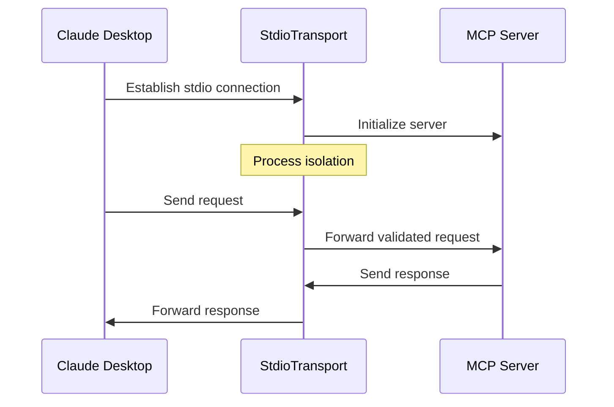

# Security Architecture

## Overview

The Prompt++ MCP Server implements defense-in-depth security with multiple layers of protection for safe operation in development environments.

## Security Principles

1. **Principle of Least Privilege**: Server operates with minimal required permissions
2. **Input Validation**: All inputs validated before processing
3. **Secure by Default**: Safe defaults for all configurations
4. **No Code Execution**: Templates are text-only, no eval() or dynamic execution
5. **Isolation**: MCP transport layer provides process isolation

## Authentication & Authorization

### MCP Transport Security


### Security Boundaries
- **Process Isolation**: Server runs as separate process
- **Transport Layer**: stdio communication only
- **No Network Access**: Server doesn't open network ports
- **Client Authentication**: Handled by MCP client (Claude Desktop)

## Input Validation

### Schema Validation

```typescript
// Tool input validation example
const ManageCollectionSchema = {
  type: 'object',
  properties: {
    action: {
      type: 'string',
      enum: ['create', 'delete', 'add_strategy', 'remove_strategy', 'update']
    },
    collection: {
      type: 'string',
      pattern: '^[a-zA-Z0-9_-]+$'  // Safe characters only
    }
  },
  required: ['action', 'collection']
};
```

### Validation Layers

1. **MCP Protocol Validation**
   - Request structure validation
   - Parameter type checking
   - Required field enforcement

2. **Application Validation**
   - Business logic validation
   - Range and constraint checks
   - Referential integrity

3. **Content Validation**
   - Template placeholder verification
   - JSON structure validation
   - Size limits enforcement

## Data Protection

### Sensitive Data Handling

```typescript
// No secrets in templates or responses
interface SecureStrategy {
  template: string;  // Text only, no secrets
  // Never include:
  // - API keys
  // - Passwords
  // - Personal data
  // - File paths outside allowed directories
}
```

### File System Security

```typescript
// Restricted file access
const ALLOWED_PATHS = [
  'metaprompts/',                    // Built-in strategies
  '~/.prompt-plus-plus/',           // User config
  process.env.PROMPT_PLUS_CUSTOM_DIR // Custom override
];

// Path traversal prevention
function validatePath(path: string): boolean {
  const resolved = path.resolve(path);
  return ALLOWED_PATHS.some(allowed => 
    resolved.startsWith(path.resolve(allowed))
  );
}
```

## Error Handling Security

### Safe Error Messages

```typescript
// Good: Generic error without details
throw new Error('Strategy not found');

// Bad: Exposing internal paths
// throw new Error(`Strategy not found at ${fullPath}`);

// Good: Structured logging without sensitive data
logger.error('Strategy load failed', {
  strategy: strategyKey,
  source: 'custom'
  // No file paths or system details
});
```

### Error Response Sanitization

```typescript
interface SafeErrorResponse {
  error: string;          // Generic message
  code?: string;          // Error code
  // Never include:
  // - Stack traces
  // - File paths
  // - System information
}
```

## Threat Model

### Potential Threats and Mitigations

| Threat | Impact | Mitigation |
|--------|--------|------------|
| Malicious prompt injection | Low | Text-only templates, no code execution |
| Path traversal | Medium | Path validation, restricted directories |
| Resource exhaustion | Low | Size limits, timeout handling |
| Information disclosure | Low | Sanitized errors, no sensitive data in responses |
| Privilege escalation | Low | Process isolation, no system calls |

### Attack Surface

1. **MCP Protocol**
   - Mitigated by: Protocol validation, schema enforcement
   
2. **File System Access**
   - Mitigated by: Restricted paths, read-only operations
   
3. **User-Provided Content**
   - Mitigated by: Input validation, size limits

## Security Best Practices

### For Server Development

1. **Never Trust User Input**
   ```typescript
   // Always validate
   if (!isValidStrategyKey(key)) {
     throw new Error('Invalid strategy key');
   }
   ```

2. **Fail Securely**
   ```typescript
   try {
     return loadStrategy(key);
   } catch (error) {
     // Log internally, return safe error
     logger.error('Strategy load failed', { key });
     return null;  // Safe default
   }
   ```

3. **Minimize Attack Surface**
   - No unnecessary features
   - No network endpoints
   - No system command execution

### For Users

1. **Custom Strategy Security**
   - Review custom strategies before adding
   - Don't include secrets in templates
   - Use environment variables for configuration

2. **Collection Sharing**
   - Verify collection sources
   - Review strategies before importing
   - Don't share collections with sensitive data

## Compliance Considerations

### Data Privacy
- No personal data collection
- No telemetry or analytics
- Local-only operation
- User controls all data

### Open Source Security
- Regular dependency updates
- Security vulnerability scanning
- Public code review
- Responsible disclosure process

## Security Monitoring

### Logging Strategy

```typescript
// Security-relevant events
logger.info('Server started', {
  version: VERSION,
  customDir: customDir ? 'configured' : 'default'
});

logger.warn('Invalid strategy key attempted', {
  key: sanitizeKey(attemptedKey)
});

logger.error('Validation failed', {
  type: 'schema',
  tool: toolName
});
```

### Metrics to Monitor
- Failed validation attempts
- Error rates by type
- Resource usage patterns
- Unusual request patterns

## Incident Response

### Security Issue Reporting
1. Report via GitHub Security Advisory
2. Include: Description, impact, steps to reproduce
3. Do not disclose publicly until fixed

### Response Process
1. Acknowledge within 48 hours
2. Assess severity and impact
3. Develop and test fix
4. Release patch and advisory
5. Credit reporter (if desired)

## Future Security Enhancements

### Planned Improvements
1. Content Security Policy for templates
2. Rate limiting for resource-intensive operations
3. Audit logging for security events
4. Automated security testing

### Under Consideration
1. Template sandboxing
2. Strategy signing/verification
3. Role-based access control
4. Encrypted storage for sensitive collections