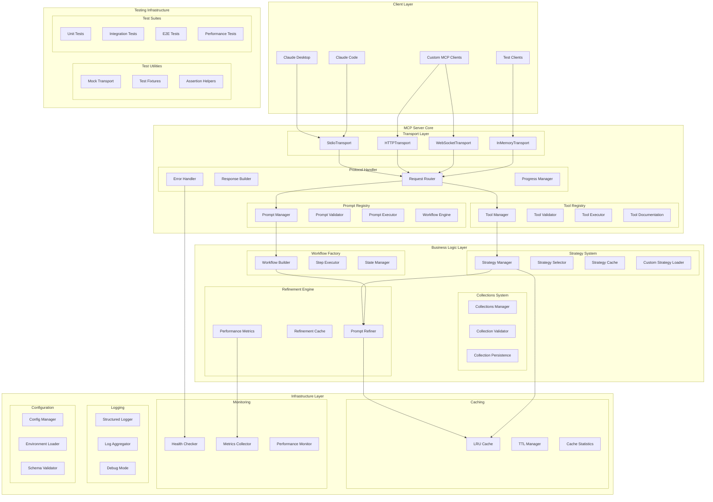

# Prompt++ MCP Server - Improved Architecture Overview

## Executive Summary

This document outlines the improved architecture for the Prompt++ MCP Server, focusing on enhanced developer experience through modular design, better error handling, comprehensive testing support, and performance optimization.

## Architecture Vision

Transform the current monolithic MCP server into a highly modular, extensible, and developer-friendly system that provides:
- **Seamless Integration**: Easy setup and configuration for developers
- **Superior Performance**: Sub-millisecond response times with intelligent caching
- **Robust Testing**: Comprehensive test suite with mocking capabilities
- **Clear Documentation**: Self-documenting APIs with interactive examples
- **Enterprise Ready**: Production-grade monitoring, logging, and error handling

## System Architecture



## Component Architecture

### 1. Transport Layer (Improved)
- **Multiple Transport Support**: StdIO, HTTP, WebSocket, and In-Memory for testing
- **Transport Abstraction**: Common interface for all transport types
- **Connection Management**: Automatic reconnection and keepalive
- **Request/Response Pipeline**: Streaming support for large payloads

### 2. Protocol Handler (New)
- **Request Router**: Intelligent routing based on capability type
- **Response Builder**: Consistent response formatting with metadata
- **Error Handler**: Centralized error processing with context
- **Progress Manager**: Real-time progress updates for long operations

### 3. Tool & Prompt Registries (Enhanced)
- **Dynamic Registration**: Runtime tool/prompt addition and removal
- **Schema Validation**: Zod-based validation for all inputs/outputs
- **Documentation Generation**: Auto-generate docs from schemas
- **Version Management**: Support multiple versions of tools/prompts

### 4. Business Logic Layer (Refactored)
- **Dependency Injection**: Clear component dependencies
- **Interface Segregation**: Small, focused interfaces
- **Event-Driven Updates**: Pub/sub for state changes
- **Plugin Architecture**: Easy extension points

### 5. Infrastructure Layer (New)
- **Advanced Caching**: Multi-tier caching with statistics
- **Comprehensive Monitoring**: Health, metrics, and performance
- **Structured Logging**: JSON logs with correlation IDs
- **Configuration Management**: Environment-based with validation

### 6. Testing Infrastructure (New)
- **Mock Transport**: In-memory transport for unit tests
- **Test Fixtures**: Reusable test data and scenarios
- **Assertion Helpers**: MCP-specific test utilities
- **Performance Benchmarks**: Track performance regressions

## Key Improvements

### Developer Experience
1. **Zero Configuration**: Works out of the box with sensible defaults
2. **Hot Reloading**: Automatic reload on file changes in development
3. **Interactive Documentation**: Try tools/prompts directly from docs
4. **Debug Mode**: Verbose logging with performance traces
5. **TypeScript First**: Full type safety with generated types

### Performance
1. **Intelligent Caching**: LRU cache with TTL and invalidation
2. **Lazy Loading**: Load strategies on demand
3. **Connection Pooling**: Reuse transport connections
4. **Streaming Responses**: Handle large payloads efficiently
5. **Resource Limits**: Configurable memory and CPU limits

### Reliability
1. **Graceful Degradation**: Continue with reduced functionality
2. **Circuit Breakers**: Prevent cascading failures
3. **Retry Logic**: Automatic retry with exponential backoff
4. **Health Checks**: Built-in diagnostics endpoints
5. **Error Recovery**: Self-healing capabilities

### Security
1. **Input Validation**: Comprehensive schema validation
2. **Rate Limiting**: Prevent resource exhaustion
3. **Audit Logging**: Track all tool/prompt usage
4. **Sandboxing**: Isolated execution environments
5. **Permission System**: Fine-grained access control

## Data Flow Patterns

### 1. Request Processing Pipeline
```
Client Request → Transport Layer → Protocol Handler → Request Router
    ↓
Schema Validation → Registry Lookup → Business Logic → Response Builder
    ↓
Transport Layer → Client Response
```

### 2. Strategy Selection Flow
```
User Prompt → Keyword Analysis → Category Matching → Strategy Scoring
    ↓
Cache Check → Strategy Selection → Template Application → Result Caching
```

### 3. Error Handling Flow
```
Error Occurrence → Context Collection → Error Classification → Handler Selection
    ↓
Recovery Attempt → Fallback Logic → Error Response → Monitoring Alert
```

## Implementation Modules

### Core Modules
1. **transport/**: Multi-transport support with common interface
2. **protocol/**: MCP protocol implementation and handlers
3. **registry/**: Tool and prompt registration system
4. **business/**: Strategy management and refinement logic
5. **infrastructure/**: Caching, logging, monitoring, config

### Extension Modules
1. **plugins/**: Plugin system for custom extensions
2. **testing/**: Test utilities and mock implementations
3. **cli/**: Command-line tools for development
4. **docs/**: Auto-generated documentation system

## Migration Path

### Phase 1: Core Refactoring (Week 1-2)
- Extract transport layer abstraction
- Implement protocol handler
- Create tool/prompt registries
- Add basic monitoring

### Phase 2: Enhanced Features (Week 3-4)
- Add multiple transport support
- Implement advanced caching
- Create testing infrastructure
- Add hot reloading

### Phase 3: Developer Tools (Week 5-6)
- Build interactive documentation
- Add debug mode
- Create CLI tools
- Implement performance benchmarks

### Phase 4: Production Hardening (Week 7-8)
- Add comprehensive monitoring
- Implement security features
- Create deployment guides
- Performance optimization

## Success Metrics

1. **Developer Adoption**: 50% faster integration time
2. **Performance**: <10ms response time for 95% of requests
3. **Reliability**: 99.9% uptime with graceful degradation
4. **Test Coverage**: >90% code coverage with E2E tests
5. **Documentation**: 100% API coverage with examples

## Next Steps

1. Review and approve architecture design
2. Create detailed technical specifications
3. Set up development environment
4. Begin Phase 1 implementation
5. Establish testing and monitoring practices