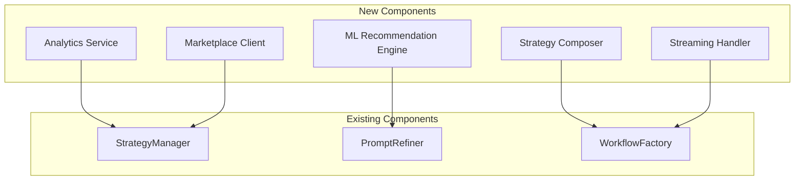

# MCP Implementation Enhancement Plan

## Executive Summary

The Prompt++ MCP Server is a mature, well-architected implementation that provides intelligent prompt refinement through 44+ metaprompt strategies. This plan outlines potential enhancements to further improve the system's capabilities, performance, and developer experience.

## Current State Analysis

### Strengths
- ✅ Complete MCP v1.0.0 implementation
- ✅ Modular, extensible architecture
- ✅ Comprehensive strategy library (44+ strategies)
- ✅ Custom strategy support
- ✅ Collections management
- ✅ Performance monitoring
- ✅ Robust error handling
- ✅ TypeScript with strong typing

### Areas for Enhancement
- 🔄 Response streaming for large outputs
- 📊 Enhanced analytics and insights
- 🌐 Internationalization support
- 🤖 AI-powered strategy creation
- 🔗 Strategy chaining/composition
- 📦 Strategy marketplace integration

## Phased Implementation Plan

### Phase 1: Performance Optimization (2 weeks)

**Objective**: Improve response times and resource efficiency

#### Tasks
1. **Implement Response Streaming**
   - Add streaming support for large prompt responses
   - Implement chunked transfer encoding
   - SPARC Mode: `code`
   
2. **Optimize Caching Layer**
   - Implement LRU cache with size limits
   - Add persistent cache for strategy templates
   - SPARC Mode: `refinement-optimization-mode`
   
3. **Lazy Loading Enhancements**
   - Load strategies on-demand
   - Implement progressive loading for categories
   - SPARC Mode: `code`

4. **Performance Profiling**
   - Add detailed timing metrics
   - Implement memory usage tracking
   - SPARC Mode: `debug`

### Phase 2: Enhanced Analytics (3 weeks)

**Objective**: Provide deeper insights into prompt refinement patterns

#### Tasks
1. **Usage Analytics Dashboard**
   - Track strategy effectiveness scores
   - Analyze prompt patterns and trends
   - SPARC Mode: `architect` → `code`
   
2. **Strategy Recommendation Engine**
   - ML-based strategy selection
   - Learn from usage patterns
   - SPARC Mode: `spec-pseudocode` → `tdd`
   
3. **A/B Testing Framework**
   - Compare strategy effectiveness
   - Track refinement quality metrics
   - SPARC Mode: `tdd`

### Phase 3: Advanced Features (4 weeks)

**Objective**: Add powerful new capabilities

#### Tasks
1. **Strategy Composition**
   - Chain multiple strategies
   - Create strategy pipelines
   - SPARC Mode: `architect` → `code`
   
   ```typescript
   interface StrategyPipeline {
     name: string;
     stages: StrategyStage[];
   }
   
   interface StrategyStage {
     strategy: string;
     condition?: (result: any) => boolean;
     transform?: (result: any) => any;
   }
   ```

2. **Dynamic Strategy Generation**
   - AI-powered strategy creation
   - Learn from successful refinements
   - SPARC Mode: `spec-pseudocode` → `tdd`
   
3. **Multi-language Support**
   - Internationalize strategies
   - Support non-English prompts
   - SPARC Mode: `code`

### Phase 4: Developer Experience (2 weeks)

**Objective**: Improve integration and debugging capabilities

#### Tasks
1. **Enhanced Development Tools**
   - Strategy testing framework
   - Interactive strategy builder
   - SPARC Mode: `tdd`
   
2. **Debug Mode Improvements**
   - Step-through refinement process
   - Visualize strategy selection
   - SPARC Mode: `debug`
   
3. **SDK Development**
   - TypeScript/JavaScript SDK
   - Python client library
   - SPARC Mode: `code`

### Phase 5: Enterprise Features (3 weeks)

**Objective**: Add enterprise-grade capabilities

#### Tasks
1. **Strategy Marketplace**
   - Share/discover strategies
   - Rating and review system
   - SPARC Mode: `architect` → `integration`
   
2. **Team Collaboration**
   - Shared collections
   - Strategy versioning
   - SPARC Mode: `spec-pseudocode` → `code`
   
3. **Audit and Compliance**
   - Strategy usage logs
   - Compliance reporting
   - SPARC Mode: `security-review`

## Technical Implementation Details

### New Architecture Components



### API Additions

#### New Tools

1. **compose_strategy**
   ```typescript
   {
     input: {
       strategies: string[];
       mode: 'sequential' | 'conditional';
       conditions?: Record<string, any>;
     }
   }
   ```

2. **analyze_usage**
   ```typescript
   {
     input: {
       timeRange?: string;
       groupBy?: 'strategy' | 'category' | 'time';
     }
   }
   ```

3. **test_strategy**
   ```typescript
   {
     input: {
       strategy: string;
       testPrompts: string[];
       metrics?: string[];
     }
   }
   ```

#### New Prompts

1. **adaptive_refine**
   - Uses ML to select optimal strategy
   - Learns from past refinements
   
2. **chain_refinement**
   - Applies multiple strategies in sequence
   - Supports conditional logic

## Testing Strategy

### Unit Testing
- Test each new component in isolation
- Maintain 90%+ code coverage
- SPARC Mode: `tdd`

### Integration Testing
- Test MCP protocol compliance
- Verify backward compatibility
- SPARC Mode: `integration`

### Performance Testing
- Benchmark response times
- Load test with concurrent requests
- Memory usage profiling

## Migration and Rollout

### Version Strategy
- v5.0.0: Performance optimizations
- v5.1.0: Analytics features
- v6.0.0: Advanced features (breaking changes)
- v6.1.0: Developer tools
- v7.0.0: Enterprise features

### Backward Compatibility
- Maintain existing API contracts
- Deprecate features with warnings
- Provide migration guides

## Resource Requirements

### Development Team
- 2 Senior Engineers
- 1 ML Engineer (Phase 2)
- 1 Frontend Developer (Dashboard)
- 1 DevOps Engineer

### Infrastructure
- CI/CD pipeline enhancements
- Analytics database (Phase 2)
- Marketplace infrastructure (Phase 5)

## Success Metrics

### Performance
- 50% reduction in response time
- 30% reduction in memory usage
- Support for 10x larger prompts

### Adoption
- 2x increase in custom strategies
- 5x increase in collection usage
- 90% user satisfaction score

### Quality
- 0 critical bugs in production
- 95%+ test coverage
- 99.9% uptime

## Risk Mitigation

### Technical Risks
- **Complexity**: Mitigate with modular design
- **Performance**: Continuous profiling and optimization
- **Compatibility**: Extensive testing matrix

### Adoption Risks
- **Learning Curve**: Comprehensive documentation
- **Migration**: Automated migration tools
- **Feature Creep**: Strict scope management

## Next Steps

1. **Review and Approval**: Get stakeholder buy-in
2. **Team Assembly**: Recruit necessary resources
3. **Phase 1 Kickoff**: Start with performance optimization
4. **Weekly Progress Reviews**: Track against milestones
5. **User Feedback Loop**: Continuous improvement

## Conclusion

This implementation plan provides a roadmap for evolving the Prompt++ MCP Server from an excellent prompt refinement tool to a comprehensive prompt engineering platform. The phased approach ensures continuous delivery of value while maintaining system stability and backward compatibility.